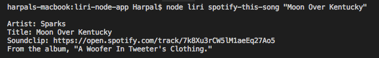
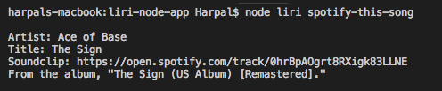
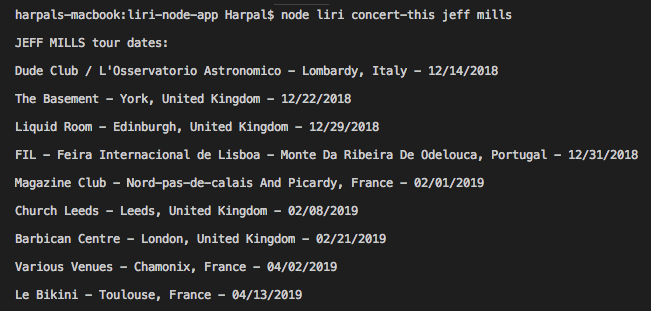
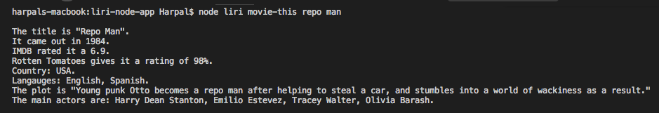
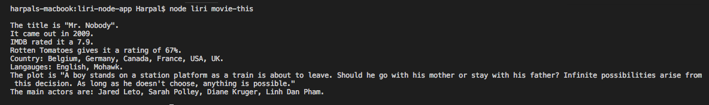
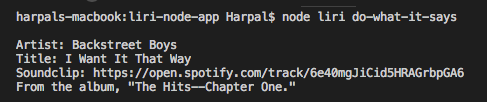

# LIRI - a command line bot 🤖

### Overview 
LIRI (Language Interpretation and Recognition Interface) is a node.js command line bot that quickly searches OMDB, BandsInTown, and Spotify for movie, concert, and song information.

### Install
Clone this folder to your hard drive and then run 
```npm install```.

This will install the following dependencies:
```dotenv
   axios
   moment
   node-spotify-api
   fs
```


### Commands
* Use the following commands followed by your search query.
```
   node liri spotify-this-song 
   node liri movie-this 
   node liri concert-this 
   node liri do-what-it-says
```

#### 🎵 Spotify This Song 🎵
* Returns the following details for a song title entered.



* If nothing is entered, it will default to the following.



#### 🎺 Concert This 🎺
* Returns the upcoming tour dates in a list for the artist entered.



#### 🍿 Movie This 🍿
* Returns the following details for the movie entered.



* If nothing is entered, it will default to the following.



#### 🗒️ Do What It Says 🗒️
* Returns the text that is located in random.txt. In this case its 
```spotify-this-song,"I Want it That Way"```

